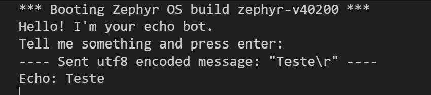
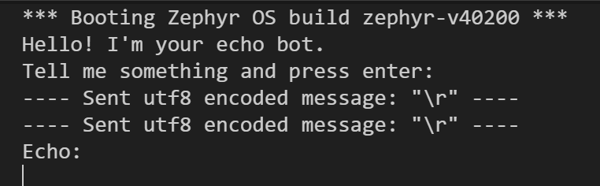
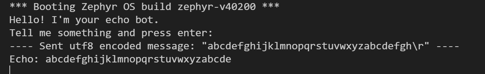
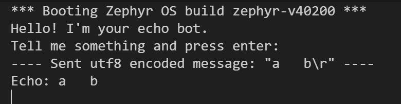

# PSI-Microcontroladores2-Aula10
Atividade: Comunicação UART

# Projeto UART – Atividade em Duplas (Echo Bot + Async API)

## 1. Informações Gerais

* Dupla:

  * Integrante 1: Enzo Shinzato
  * Integrante 2: Henrique Lima

* Objetivo: implementar, testar e documentar aplicações de comunicação UART baseadas nos exemplos oficiais “echo_bot” e “async_api”, utilizando desenvolvimento orientado a testes, diagramas de sequência D2 e registro de evidências.

---

# 2. Estrutura Esperada do Repositório

```
README.md
src/

docs/
  evidence/
  sequence-diagrams/

```

---

# 3. Etapa 1 – Echo Bot (UART Polling/Interrupt)

## 3.1 Descrição do Funcionamento

O programa do exemplo oficial primeiramente executa a inicialização da UART (caso esteja disponível na placa). Em seguida, define o tamanho da mensagem, com base nesse tamanho, são criados dois buffers: o primeiro, onde a mensagem será armazenada, e o segundo, que armazenará as mensagens recebidas. Após isso, é definida uma função responsável por ler todos os caracteres até encontrar o caractere de fim de texto ('\0'). Concluída a leitura, a mensagem é armazenada no buffer. Por fim, o programa imprime no terminal o texto digitado pelo usuário.

## 3.2 Casos de Teste Planejados (TDD)

### CT1 – Eco básico

* Entrada: Teste
* Saída esperada: Teste
* Critério de Aceitação: O programa deve retornar a mesma palavra digitada pelo o usuário com até 32 bits.

### CT2 – Linha vazia

* Entrada:
* Saída esperada:
* Critério de Aceitação: O programa deve reconher a linha vazia e não retornar nada.

### CT3 – Linha longa (maior que 32 bits)

* Entrada: abcdefghijklmnopqrstuvwxyzabcdefgh
* Saída esperada: abcdefghijklmnopqrstuvwxyzabcde
* Critério de Aceitação: O programa deve aparacer até 31 bits no terminal, o último bit será armazenado o caractere de fim de linha.

### CT4 – Espaçamento

* Entrada: a&nbsp;&nbsp;&nbsp;b
* Saída esperada: a&nbsp;&nbsp;&nbsp;b
* Critério de Aceitação: O progama deve reconher o espaçamento e armazenar corretamento o espaçamento.

## 3.3 Implementação

* Arquivo(s) modificados: Para rodarmos o exemplo foi necessário criar uma pasta de projeto e inserir o arquivo main_uart.c e prj.conf fornecido. Além disso houve alteração no CMakeList.txt e platarform.ini para mudar o arquivo main de compilação.
* Justificativa das alterações: A criação da pasta de projeto foi necessária para rodar o programa na frdm_kl25z.

## 3.4 Evidências de Funcionamento

### Teste eco básico:<br>


### Teste linha vazia:<br>


### Teste linha longa:<br>


### Teste espaçamento:<br>


## 3.5 Diagramas de Sequência D2


### Código-base para geração do diagrama:

```
shape: sequence_diagram

Input
RX
Verificação
TX
Output
Terminal

Input -> RX: Envia caractere via UART
RX -> Verificação: Passa caractere recebido para transmissão
Verificação -> TX: Verifica se o caractere não ultrapassou o limite ou se é um caractere de fim '/0'
TX -> Output: Reenvia o mesmo caractere (eco)
Output -> Terminal: Exibe caractere ecoado
```

---

# 4. Etapa 2 – Async API (Transmissão/Recepção Assíncrona)

## 4.1 Descrição do Funcionamento

O exemplo oficial da API assíncrona de UART do Zephyr registra uma função de callback, responsável por tratar os eventos gerados durante as operações de transmissão e recepção. Após essa etapa, o sistema entra em um loop contínuo de alternância entre os modos TX e RX. Primeiramente, é executada a transmissão de uma sequência de pacotes, utilizando a função uart_tx(), que envia os dados de forma assíncrona. Quando a transmissão é concluída, o evento correspondente é identificado pelo callback, indicando que o sistema pode prosseguir. Na sequência, o programa habilita o modo de recepção por meio da função uart_rx_enable(), preparando um buffer para armazenar os dados recebidos. Durante o período em que o RX está ativo, qualquer dado recebido é processado e armazenado, sendo sinalizado pelos eventos de recepção. Após determinado intervalo de tempo, ou quando a comunicação é finalizada, a recepção é desabilitada e o ciclo retorna ao modo de transmissão. Assim, o comportamento esperado é uma alternância periódica e controlada entre o envio e a leitura de dados, demonstrando o funcionamento da comunicação UART assíncrona no Zephyr.

## 4.2 Casos de Teste Planejados (TDD)

### CT1 – Transmissão de pacotes a cada 5s

Objetivo: Garantir que o sistema envie dados (TX mode) somente após os 5s de RX.
Critérios:
1. Sistema inicia em RX mode.
2. Após k_sleep(5s), entra em TX mode.
3. Se a fila (uart_msgq) tem dados, eles são enviados.
4. A transmissão ocorre a cada 5 segundos.

Resultados obtidos pelo Serial Monitor:<br>
---- Opened the serial port COM4 ----<br>
*** Booting Zephyr OS build zephyr-v40200 ***<br>
[00:00:00.004,000] <inf> sample: RX is now enabled - Cycle 1<br>
[00:00:00.010,000] <inf> sample: UART callback: RX_RDY<br>
[00:00:05.015,000] <inf> sample: RX is now disabled - Cycle 1<br>
[00:00:05.021,000] <inf> sample: UART callback: TX_DONE<br>
[00:00:10.127,000] <inf> sample: RX is now enabled - Cycle 2<br>
[00:00:10.133,000] <inf> sample: UART callback: RX_RDY<br>
[00:00:15.139,000] <inf> sample: RX is now disabled - Cycle 2<br>
[00:00:15.145,000] <inf> sample: UART callback: TX_DONE<br>
[00:00:20.251,000] <inf> sample: RX is now enabled - Cycle 3<br>
[00:00:20.257,000] <inf> sample: UART callback: RX_RDY<br>
---- Closed the serial port COM4 ----

Conclusão: o comportamento está conforme previsto no teste.

### CT2 – Recepção
Objetivo: Garantir que o callback do UART recebe os bytes monte o buffer e ao encontrar \n ou \r envie para a fila.

Critérios:
1. serial_cb deve montar a string.
2. Ao final da linha, deve chamar:
3. k_msgq_put(&uart_msgq, ...)

O buffer deve ser limpo.


### CT3 – Verificação de timing dos 5s
O sistema deve alternar: RX → espera 5s → TX → espera 5s → RX → ...

Critérios:
1. RX dura 5 segundos.
2. TX dura 5 segundos.
3. Variável in_rx_mode alterna corretamente.
4. O log ou flag interna marca cada transição.

O mesmo log do CT1 serve de evidência devido aos tempos exibidos:
[00:00:00.004,000] <inf> sample: RX is now enabled - Cycle 1<br>
[00:00:00.010,000] <inf> sample: UART callback: RX_RDY<br>
[00:00:05.015,000] <inf> sample: RX is now disabled - Cycle 1<br>
[00:00:05.021,000] <inf> sample: UART callback: TX_DONE<br>
[00:00:10.127,000] <inf> sample: RX is now enabled - Cycle 2<br>
[00:00:10.133,000] <inf> sample: UART callback: RX_RDY<br>
[00:00:15.139,000] <inf> sample: RX is now disabled - Cycle 2<br>
[00:00:15.145,000] <inf> sample: UART callback: TX_DONE

## 4.3 Implementação

* Arquivo(s) modificados: Para rodarmos o exemplo foi necessário criar uma pasta de projeto e inserir o arquivo main_uart.c e prj.conf fornecido. Houve também alteração no CMakeList.txt e platarform.ini para mudar o arquivo main de compilação.
* Justificativa das alterações: A criação da pasta de projeto foi necessária para rodar o programa na frdm_kl25z.Além disso, devido ao mal funcionamento da API uart async foi utilizado o a API do echo bot simulando o funcionamento assíncrono do uart.

## 4.4 Evidências de Funcionamento


## 4.5 Diagramas de Sequência D2


RX_MODE: RX Mode (in_rx_mode = true)
WAIT_RX: Espera 5s
IRQ: UART IRQ\nRecebe dados
STORE: Armazena mensagem\nna fila (msgq)
TX_MODE: TX Mode (in_rx_mode = false)
CHECK_MSG: Há mensagens na fila?
SEND: Envia mensagem\n(print_uart)
WAIT_TX: Espera 5s
LOOP: Volta ao início

RX_MODE -> WAIT_RX -> IRQ
IRQ -> STORE
WAIT_RX -> TX_MODE
TX_MODE -> CHECK_MSG
CHECK_MSG -> SEND: Sim
SEND -> CHECK_MSG
CHECK_MSG -> WAIT_TX: Não
WAIT_TX -> LOOP
LOOP -> RX_MODE


# 5. Conclusões da Dupla

* O que deu certo:
* O que foi mais desafiador:
